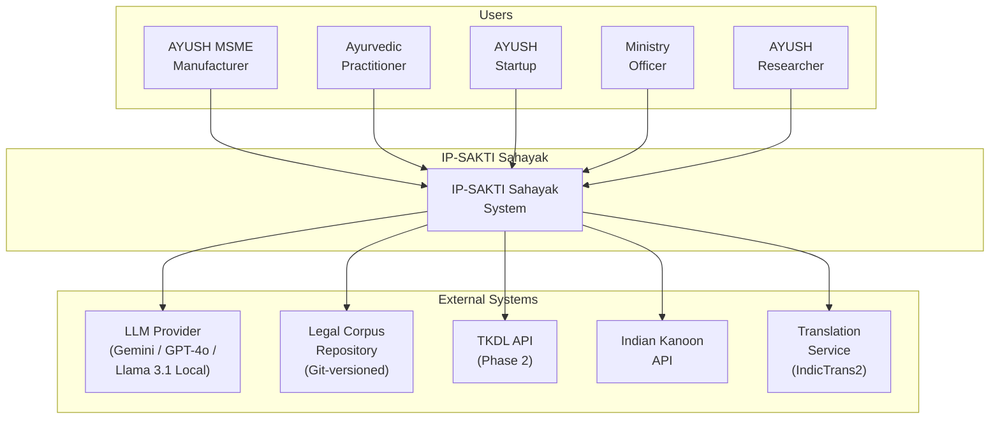
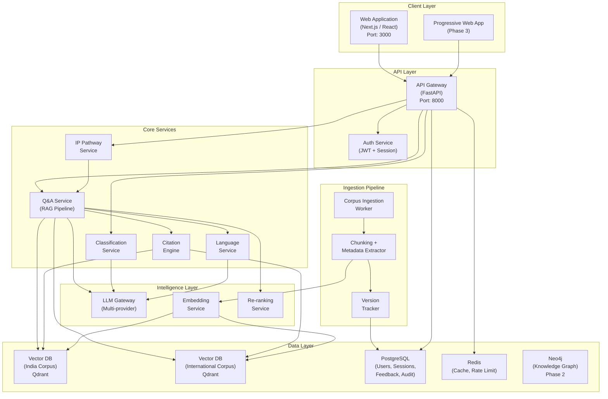
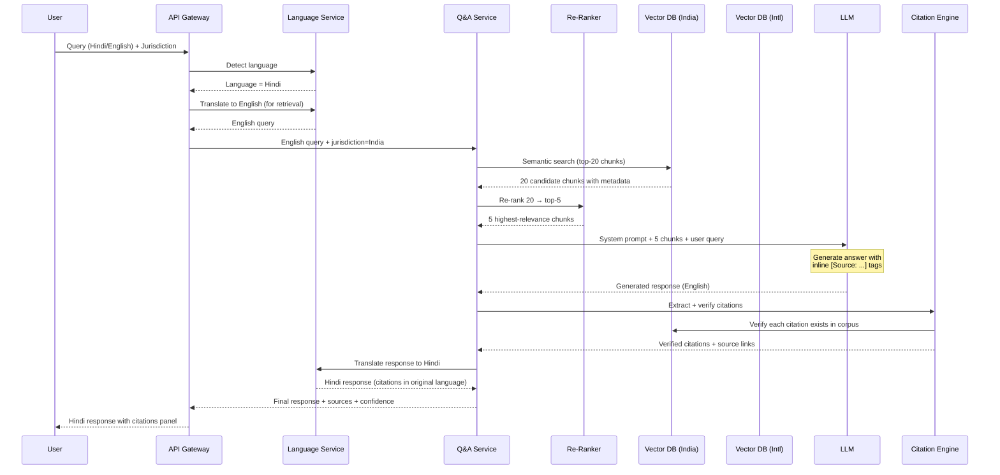
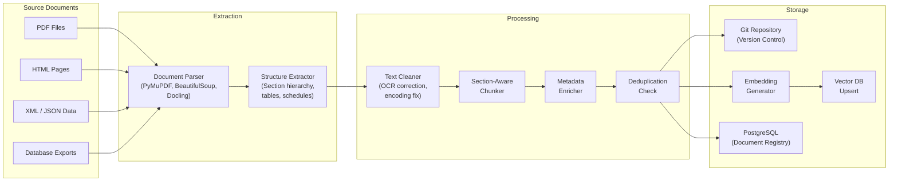
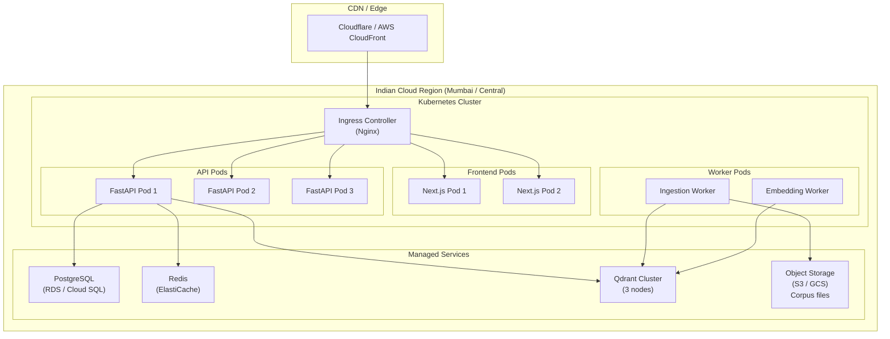

# IP-SAKTI Sahayak — System Architecture

> **Document ID:** IPSAKTI-ARCH-001  
> **Version:** 1.0  
> **Status:** Ideation / Pre-Build  
> **Owner:** Engineering Lead  
> **Last Updated:** 2026-09-27  
> **Prerequisites:** [solution.md](file:///E:/Projects/Active/IP-SAKTI-1/documents/solution.md)

---

## 1. Architecture Principles

| # | Principle | Rationale |
|---|---|---|
| AP-01 | **Citation-first** — Every response path must include a citation pipeline | Core trust requirement; without citations the system has no value |
| AP-02 | **Jurisdiction-isolated** — Indian and International corpora are physically separated | Prevents accidental cross-contamination at the retrieval level |
| AP-03 | **Corpus-versioned** — Every document has an effective date and amendment chain | Legal advice based on outdated law is wrong advice |
| AP-04 | **Model-agnostic** — LLM can be swapped without re-architecture | Avoids vendor lock-in; enables on-premise deployment |
| AP-05 | **Fail-safe** — When in doubt, refuse and escalate | A wrong answer is worse than no answer for legal guidance |
| AP-06 | **Mobile-first** — UI designed for smartphone-primary users | 70%+ MSME users access via mobile |
| AP-07 | **Stateless API** — Backend services are stateless; state in DB/cache | Enables horizontal scaling |

---

## 2. High-Level Architecture (C4 — Context)



---

## 3. Container Architecture (C4 — Container)



---

## 4. Technology Stack

### 4.1 Stack Decisions

| Layer | Technology | Rationale | Alternative Considered |
|---|---|---|---|
| **Frontend** | Next.js 14+ (App Router) + TypeScript | SSR for SEO; React ecosystem; mobile-responsive | Vite + React (no SSR) |
| **UI Components** | shadcn/ui + Tailwind CSS | Accessible, customisable, production-ready | Material UI (heavier) |
| **API Server** | FastAPI (Python 3.11+) | Async, typed, OpenAPI docs auto-generated; LangChain/LlamaIndex ecosystem is Python | Express.js (weaker AI library ecosystem) |
| **LLM (Primary)** | Google Gemini 1.5 Pro / 2.0 Flash | Long context (1M tokens); multilingual; cost-effective | GPT-4o (higher cost); Llama 3.1 (local, but weaker Hindi) |
| **LLM (Fallback)** | Llama 3.1 70B (local) | On-premise option for data sovereignty | Mixtral 8x22B |
| **Embedding Model** | Gemini text-embedding-004 or sentence-transformers/multilingual-e5-large | Multilingual; high quality | OpenAI ada-002 (English-biased) |
| **Vector Database** | Qdrant (self-hosted) | Open-source; filtering; payload storage; performant | Pinecone (managed, but US-hosted); Weaviate |
| **Relational DB** | PostgreSQL 16 | Proven; JSON support; full-text search fallback | SQLite (not production-grade for multi-user) |
| **Cache** | Redis 7 | Session cache, rate limiting, response cache | Memcached (fewer features) |
| **Knowledge Graph** | Neo4j Community (Phase 2) | Mature graph DB; Cypher query language | Amazon Neptune (vendor lock-in) |
| **Orchestration** | LangGraph / custom agent loop | Agentic multi-step reasoning; tool use | LlamaIndex Agents; CrewAI |
| **Translation** | AI4Bharat IndicTrans2 | SOTA for Indian languages; open-source | Google Translate API (cost; data leaves India) |
| **Containerisation** | Docker + Docker Compose | Standard; portable | Podman |
| **CI/CD** | GitHub Actions | Free tier; good ecosystem | GitLab CI |
| **Monitoring** | Prometheus + Grafana | Open-source observability | Datadog (cost) |
| **Logging** | Structured JSON logs + Loki | Searchable; cost-effective | ELK stack (heavier) |

### 4.2 MVP vs. Production Stack Differences

| Component | MVP (Hackathon) | Production |
|---|---|---|
| LLM | Gemini API (cloud) | Gemini API + on-premise Llama fallback |
| Vector DB | Qdrant (Docker, single node) | Qdrant (cluster, 3 nodes) |
| Database | SQLite or PostgreSQL (single instance) | PostgreSQL (managed, HA) |
| Cache | In-memory dict | Redis cluster |
| Hosting | Single VM / local machine | Kubernetes on Indian cloud (AWS Mumbai / Azure India Central) |
| SSL | Self-signed or ngrok | Let's Encrypt / ACM |
| Auth | Session-based, no login | JWT + OAuth2 |

---

## 5. RAG Pipeline Architecture

### 5.1 Retrieval Flow



### 5.2 Chunking Strategy

| Parameter | Value | Rationale |
|---|---|---|
| **Chunk size** | 512 tokens | Balances context vs. precision for legal text |
| **Overlap** | 64 tokens | Preserves cross-boundary context |
| **Chunking method** | Section-aware (Act → Part → Chapter → Section → Sub-section) | Legal text has rigid hierarchical structure |
| **Metadata per chunk** | `{doc_id, doc_title, jurisdiction, effective_date, section_id, section_title, amendment_history, language}` | Enables filtered retrieval and citation construction |
| **Special handling** | Pharmacopoeial monographs chunked per monograph (entire monograph = 1 chunk) | Monographs are self-contained; splitting loses meaning |
| **Formulation entries** | AFI formulations chunked per formulation (name + ingredients + method + indication) | Atomic unit for prior-art search |

### 5.3 Dual-Index Architecture

```
┌──────────────────────────────────────────────────────────────────┐
│                    VECTOR DB ARCHITECTURE                        │
├──────────────────────┬───────────────────────────────────────────┤
│                      │                                           │
│  Collection:         │  Collection:                              │
│  india_corpus        │  international_corpus                     │
│                      │                                           │
│  ├── patents_act     │  ├── trips_agreement                     │
│  ├── gi_act          │  ├── paris_convention                    │
│  ├── tm_act          │  ├── pct                                 │
│  ├── bd_act          │  ├── cbd                                 │
│  ├── dc_act          │  ├── nagoya_protocol                     │
│  ├── ayush_rules     │  ├── berne_convention                    │
│  ├── api_monographs  │  ├── wipo_igc                            │
│  ├── afi_formulations│  ├── codex_alimentarius                  │
│  ├── fssai_regs      │  ├── who_tm_strategy                    │
│  ├── case_law        │  └── budapest_treaty                     │
│  └── tkdl_entries    │                                           │
│                      │                                           │
│  Filter fields:      │  Filter fields:                           │
│  - doc_type          │  - treaty_name                            │
│  - effective_date    │  - effective_date                         │
│  - section_id        │  - article_id                             │
│  - amendment_version │  - signatory_countries                    │
│  - language          │  - language                               │
│                      │                                           │
└──────────────────────┴───────────────────────────────────────────┘
```

**Critical design decision:** The India and International collections are **physically separate**. The jurisdiction switch determines which collection(s) the retrieval query hits. In "Both" mode, both are queried and results are tagged and presented side-by-side.

---

## 6. Corpus Ingestion Pipeline



### 6.1 Version Tracking Schema

```sql
CREATE TABLE corpus_documents (
    id              UUID PRIMARY KEY DEFAULT gen_random_uuid(),
    doc_key         TEXT NOT NULL UNIQUE,        -- e.g. "patents_act_1970"
    title           TEXT NOT NULL,
    jurisdiction    TEXT NOT NULL CHECK (jurisdiction IN ('india', 'international')),
    doc_type        TEXT NOT NULL,               -- act, rule, treaty, pharmacopoeia, formulary, case_law
    effective_date  DATE,
    amendment_date  DATE,
    version         INTEGER NOT NULL DEFAULT 1,
    source_url      TEXT,
    checksum_sha256 TEXT NOT NULL,
    chunk_count     INTEGER,
    token_count     INTEGER,
    language        TEXT DEFAULT 'en',
    status          TEXT DEFAULT 'active' CHECK (status IN ('active', 'superseded', 'draft')),
    ingested_at     TIMESTAMPTZ DEFAULT NOW(),
    updated_at      TIMESTAMPTZ DEFAULT NOW()
);

CREATE TABLE corpus_chunks (
    id              UUID PRIMARY KEY DEFAULT gen_random_uuid(),
    document_id     UUID REFERENCES corpus_documents(id),
    chunk_index     INTEGER NOT NULL,
    section_id      TEXT,                        -- e.g. "s3p" for Section 3(p)
    section_title   TEXT,
    content         TEXT NOT NULL,
    token_count     INTEGER,
    embedding_id    TEXT,                        -- Vector DB point ID
    metadata_json   JSONB,
    created_at      TIMESTAMPTZ DEFAULT NOW()
);

CREATE TABLE corpus_amendments (
    id              UUID PRIMARY KEY DEFAULT gen_random_uuid(),
    document_id     UUID REFERENCES corpus_documents(id),
    amendment_act   TEXT,
    amendment_date  DATE,
    sections_affected TEXT[],
    description     TEXT,
    gazette_ref     TEXT
);
```

---

## 7. Deployment Architecture

### 7.1 MVP Deployment (Hackathon / Demo)

```
┌─────────────────────────────────────────────────────────┐
│                   Single VM / Laptop                     │
│                                                          │
│  ┌──────────────┐  ┌──────────────┐  ┌──────────────┐  │
│  │  Frontend     │  │  Backend     │  │  Qdrant      │  │
│  │  (Next.js)   │  │  (FastAPI)   │  │  (Vector DB) │  │
│  │  :3000       │  │  :8000       │  │  :6333       │  │
│  └──────────────┘  └──────────────┘  └──────────────┘  │
│                                                          │
│  ┌──────────────┐  ┌──────────────┐                     │
│  │  PostgreSQL  │  │  Redis       │                     │
│  │  :5432       │  │  :6379       │                     │
│  └──────────────┘  └──────────────┘                     │
│                                                          │
│  docker-compose.yml orchestrates all containers          │
└─────────────────────────────────────────────────────────┘
         │
         │ HTTPS (ngrok / Cloudflare Tunnel)
         ▼
    [Gemini API]  ←── LLM calls
```

### 7.2 Production Deployment



---

## 8. LLM Prompt Architecture

### 8.1 System Prompt (Core)

```
You are IP-SAKTI Sahayak, an expert AI assistant specialised in Intellectual
Property (IP) law and regulatory guidance for Ayurveda. You are deployed by
the Ministry of Ayush, Government of India.

ABSOLUTE RULES:
1. CITE EVERY CLAIM: Every legal or regulatory statement must include an inline
   citation in the format [Source: <Document Title>, <Section/Article>].
   You may ONLY cite sources provided in the CONTEXT below.
2. NEVER FABRICATE: If you cannot find a source for a claim, say "I don't have
   a source for this" and do NOT make up a citation.
3. JURISDICTION: You are currently answering for {jurisdiction} jurisdiction.
   - If jurisdiction = "India": Use ONLY Indian statutes, rules, and standards.
   - If jurisdiction = "International": Use ONLY international treaties and conventions.
   - NEVER mix jurisdictions in a single answer.
4. CONFIDENCE: Rate your confidence as HIGH, MEDIUM, or LOW.
   If LOW, add: "⚠️ This answer has low confidence. Please consult a qualified
   IP attorney for definitive guidance."
5. LANGUAGE: Respond in {response_language}. Keep legal citations in their
   original language (usually English).
6. PRODUCT CONTEXT: The user's product is classified as: {product_category}.
   Tailor all IP and regulatory advice to this category.

CONTEXT (Retrieved Sources):
{retrieved_chunks}

USER QUERY:
{user_query}
```

### 8.2 Classification Prompt

```
You are a regulatory classification expert for AYUSH products under Indian law.
Based on the user's answers to the following questions, classify the product
into EXACTLY ONE of these categories:

1. CLASSICAL_GENERIC - Formulation and method from a First-Schedule authoritative text
2. PATENT_PROPRIETARY - Manufacturer's proprietary composition, not in authoritative texts
3. NEW_DRUG - Novel drug requiring clinical trial evidence of safety and efficacy
4. PHYTOPHARMACEUTICAL - Purified plant-fraction standardised drug
5. AYUSH_AAHAR - Nutraceutical/health supplement regulated under FSSAI
6. COSMETIC - Ayurvedic cosmetic product

Provide:
- The category (one of the 6 above)
- Confidence (HIGH/MEDIUM/LOW)
- Reasoning (2-3 sentences citing the relevant rule)
- Regulatory implications (what licences/approvals are needed)

User's answers:
{classification_answers}
```

---

## 9. Error Handling & Resilience

| Failure Mode | Detection | Response | Recovery |
|---|---|---|---|
| LLM API timeout | 30s timeout | Return cached response if available; else "Service temporarily unavailable, please try again" | Retry with exponential backoff (max 3 attempts) |
| LLM API rate limit | 429 response | Queue request; inform user of wait time | Switch to fallback LLM provider |
| Vector DB unreachable | Health check failure | "Search is temporarily unavailable" | Auto-restart container; alert ops |
| Zero retrieval results | Empty result set | "I couldn't find relevant sources for this query. Try rephrasing or broadening your question." | Log for corpus gap analysis |
| Hallucination detected | Post-generation citation verification | Strip unverified claims; add disclaimer | Log for prompt improvement |
| Translation failure | IndicTrans2 error | Fall back to English response with note | Retry; log for investigation |
| Database connection lost | Connection pool exhaustion | Return 503; shed load | Auto-reconnect; scale pool |

---

## 10. Monitoring & Observability

| Signal | Tool | Alert Threshold |
|---|---|---|
| API latency (p95) | Prometheus + Grafana | > 10 seconds |
| Error rate (5xx) | Prometheus | > 2% of requests |
| Citation accuracy (sampled) | Custom evaluation pipeline | < 85% |
| Hallucination rate (sampled) | Custom detection pipeline | > 5% |
| Vector DB query latency | Qdrant metrics | > 500ms |
| LLM token usage (daily) | Provider dashboard + custom tracker | > budget threshold |
| Corpus freshness | Cron job checks | Any document > 90 days since last review |
| User feedback (negative rate) | PostgreSQL + Grafana | > 20% thumbs-down |

---

*For the detailed component-level design (SDS), see [design.md](file:///E:/Projects/Active/IP-SAKTI-1/documents/design.md). For security architecture, see [security.md](file:///E:/Projects/Active/IP-SAKTI-1/documents/security.md).*
