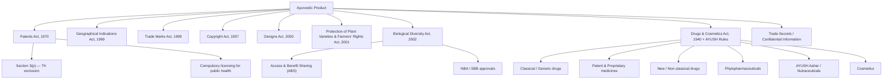

# IP-SAKTI Sahayak — Domain & Strategic Context

> **Document ID:** IPSAKTI-CTX-001  
> **Version:** 1.0  
> **Status:** Ideation / Pre-Build  
> **Owner:** Product & Strategy  
> **Last Updated:** 2026-09-27  
> **Stakeholder:** Ministry of Ayush, Government of India  

---

## 1. Executive Summary

IP-SAKTI Sahayak is a multilingual, Retrieval-Augmented Generation (RAG) AI assistant designed to provide **source-cited, jurisdiction-aware** intellectual property (IP) and regulatory guidance for the Ayurveda sector. It targets a critical gap: Ayurvedic practitioners, manufacturers, startups, researchers, and policy officers currently have no single authoritative system that unifies India's complex IP regimes (patents, GI, trademarks, trade secrets, plant-variety rights), drug-regulatory frameworks (Drugs & Cosmetics Act, AYUSH licensing), biodiversity compliance (Biological Diversity Act, Nagoya Protocol), and international treaty obligations into actionable, cited guidance.

---

## 2. Domain Landscape

### 2.1 What Is Traditional Knowledge (TK) in Ayurveda?

Ayurveda's knowledge corpus divides into two layers:

| Layer | Description | Examples |
|---|---|---|
| **Codified TK** | Documented in authoritative texts listed in the First Schedule of the Drugs & Cosmetics Act, 1940 | Charaka Samhita, Sushruta Samhita, Ashtanga Hridaya, Sharngadhara Samhita, Bhavaprakasha, Yoga Ratnakara |
| **Community-held TK** | Oral traditions, folk practices, tribal medicine; rarely written down | Village vaidya formulations, region-specific preparation methods, community-specific herbal remedies |

The Traditional Knowledge Digital Library (TKDL) — maintained by CSIR — contains >4.5 lakh formulations transliterated from 150+ Sanskrit/Hindi/Arabic/Persian texts. It serves as **prior-art evidence** at patent offices worldwide (EPO, USPTO, JPO, UKIPO) to prevent bio-piracy and erroneous patent grants.

### 2.2 Regulatory Regimes That Overlap

An Ayurvedic product's lifecycle touches **seven distinct legal regimes** simultaneously:

### 2.3 The Jurisdiction Problem

IP law operates at **two distinct layers** that must never be conflated:

| Layer | Governing Bodies | Key Instruments |
|---|---|---|
| **National (India)** | CGPDTM (Patents, TM, GI, Designs), DPIIT, NBA, SBBs, CDSCO/AYUSH Division, FSSAI | Patents Act 1970, BD Act 2002, D&C Act 1940, AYUSH licensing rules, FSSAI regulations |
| **International** | WIPO, WTO/TRIPS, CBD/COP, WHO | Paris Convention, PCT, Berne Convention, TRIPS Agreement, Nagoya Protocol, Doha Declaration, Budapest Treaty |

**Critical rule:** A practitioner asking "Can I patent this formulation?" must receive a **different answer** depending on whether they mean an Indian patent (Section 3(p) bars patents on TK *per se*) or a foreign patent (where novelty/non-obviousness is assessed against TKDL as prior art, not as a statutory bar).

---

## 3. Stakeholder Analysis

### 3.1 Primary Stakeholders

| Stakeholder | Role | Pain Point | Value from IP-SAKTI |
|---|---|---|---|
| **Ayurvedic Manufacturers (MSMEs)** | Produce and commercialise formulations | Cannot navigate overlapping IP/regulatory regimes without expensive legal counsel | Self-service IP classification and compliance roadmap |
| **Ayurvedic Practitioners (Vaidyas)** | Practise medicine, create proprietary formulations | Unaware of IP protection options for novel preparations | Guided questionnaire → IP strategy recommendation |
| **AYUSH Startups** | Develop novel Ayurvedic products, nutraceuticals | Struggle with drug-classification and GI/patent conflicts | Automated product classification + jurisdiction-aware guidance |
| **Ministry of Ayush Officials** | Policy, regulation, scheme administration | Manual query handling, inconsistent interpretation | Authoritative, cited answers for internal use |
| **Patent Agents / IP Attorneys** | File applications, advise clients | Ayurveda-specific prior-art search across TKDL is manual | RAG-powered prior-art identification with citations |
| **Researchers (Academic / CSIR)** | Publish, seek patents on novel formulations | Section 3(p) and ABS compliance uncertainty | Clear regulatory pathway analysis |

### 3.2 Secondary Stakeholders

| Stakeholder | Interest |
|---|---|
| **National Biodiversity Authority (NBA)** | ABS compliance verification |
| **CGPDTM / IPO** | Reduction in erroneous applications |
| **State Biodiversity Boards (SBBs)** | Streamlined bio-resource access requests |
| **FSSAI** | Nutraceutical / AYUSH Aahar classification clarity |
| **International Patent Offices (EPO, USPTO)** | TKDL-based prior-art validation |

---

## 4. Market Context

### 4.1 Ayurveda Market Size

| Metric | Value | Source |
|---|---|---|
| Indian AYUSH market (2025) | ₹70,000+ crore (~$8.5B) | Ministry of Ayush Annual Report 2024-25 |
| Projected CAGR (2025-2030) | 14-17% | NITI Aayog / FICCI Reports |
| Registered AYUSH manufacturers | 9,000+ | CDSCO/AYUSH database |
| AYUSH startups funded (since 2020) | 300+ | Startup India portal |
| TKDL formulations indexed | 4,50,000+ | CSIR-TKDL |
| Annual AYUSH patent applications (India) | ~2,500 | IPO Annual Report |

### 4.2 The IP Gap

- **< 5%** of AYUSH MSMEs have any formal IP protection beyond a trademark.
- **₹3-8 lakh** is the typical cost of end-to-end patent filing with an IP attorney — prohibitive for most MSMEs.
- **60%+** of patent applications in the traditional-medicine space face objections citing TKDL prior art, often because applicants did not check before filing.
- **No unified tool** currently maps an Ayurvedic product to its correct IP + regulatory pathway.

---

## 5. Competitive Landscape

### 5.1 Existing Tools & Their Gaps

| Tool / System | What It Does | What It Misses |
|---|---|---|
| **TKDL** | Prior-art database for patent offices | Not user-facing; no regulatory guidance; no multilingual Q&A |
| **InPASS / IP India Portal** | Patent/TM search | No Ayurveda-specific classification; no RAG; no citations |
| **AYUSH Licensing Portal** | Drug manufacturing licence application | No IP guidance; no product-classification assistant |
| **Generic Legal AI (e.g., Harvey, CaseText)** | General legal research | No AYUSH domain corpus; no Indian regulatory specialisation |
| **ChatGPT / Gemini (general)** | General Q&A | Hallucinations; no source citations; no jurisdiction switch; no TKDL integration |

### 5.2 SIH 2026 Competitive Field

- Only **1 of 226** live SIH 2026 problem statements asks for a genuinely similar build.
- Closest match: "AI-powered Intelligent Assistant for Indian Standards" — different domain (BIS standards), no AYUSH specificity.
- **Differentiator:** Jurisdiction-switching, product-classification workflow, and knowledge-graph-backed multi-hop reasoning are unique to this PS.

---

## 6. Regulatory Corpus Inventory

The assistant's retrieval corpus must include (at minimum) the following **version-tracked** sources:

### 6.1 National Legislation & Rules

| # | Document | Relevance |
|---|---|---|
| 1 | Patents Act, 1970 (with 2005 amendments) | Section 3(p), novelty, compulsory licensing |
| 2 | Patents Rules, 2003 (as amended) | Filing procedures, forms, timelines |
| 3 | Geographical Indications of Goods Act, 1999 | GI registration for region-specific formulations |
| 4 | Trade Marks Act, 1999 | Brand protection for proprietary medicines |
| 5 | Copyright Act, 1957 | Protection of original texts, software |
| 6 | Designs Act, 2000 | Packaging, device designs |
| 7 | Protection of Plant Varieties & Farmers' Rights Act, 2001 | Medicinal plant varieties |
| 8 | Biological Diversity Act, 2002 | ABS obligations, NBA/SBB approvals |
| 9 | Biological Diversity Rules, 2004 | Procedural details |
| 10 | Drugs & Cosmetics Act, 1940 | Drug classification, licensing |
| 11 | Drugs & Cosmetics Rules, 1945 (Parts XVI-A, Schedule T) | AYUSH-specific manufacturing standards |
| 12 | AYUSH Drug Licensing Rules | Classical vs. P&P vs. new drug classification |
| 13 | Ayurvedic Pharmacopoeia of India (API) Vols I-IX | Monographs, standards |
| 14 | Ayurvedic Formulary of India (AFI) Parts I-III | Official formulations list |
| 15 | FSSAI Regulations (Nutraceuticals, Health Supplements, AYUSH Aahar) | Food-drug boundary classification |
| 16 | National AYUSH Mission Guidelines | Scheme eligibility, incentives |
| 17 | TKDL Access Agreements & Classification Scheme | Prior-art search methodology |

### 6.2 International Treaties & Standards

| # | Document | Relevance |
|---|---|---|
| 1 | TRIPS Agreement (WTO) | Minimum IP standards, Article 27.3(b), Doha Declaration |
| 2 | Paris Convention for the Protection of Industrial Property | Priority rights, national treatment |
| 3 | Patent Cooperation Treaty (PCT) | International patent filing |
| 4 | Berne Convention | Copyright protection |
| 5 | Convention on Biological Diversity (CBD) | Sovereignty over genetic resources |
| 6 | Nagoya Protocol on ABS | Access and benefit-sharing for genetic resources |
| 7 | Budapest Treaty | Deposit of micro-organisms for patent purposes |
| 8 | WIPO IGC Texts (ongoing negotiations) | TK/TCEs/GR protection |
| 9 | WHO Traditional Medicine Strategy 2014-2023 (extended) | Global policy framework |
| 10 | Codex Alimentarius Guidelines | International food/supplement standards |

### 6.3 Registry & Case-Law Data

| Source | Type | Access Method |
|---|---|---|
| IPO Patent Register | Granted patents, published applications | API / bulk download |
| GI Registry | Registered GIs with specifications | Web scraping / RTI |
| Trademark Registry (IP India) | TM search | API |
| TKDL Database | Prior-art formulations | Licensed access (via MoU) |
| Indian Kanoon / SCC Online | Case law | API / scraping |
| IPAB / High Court orders | IP disputes in AYUSH sector | Curated collection |

---

## 7. Key Assumptions & Risks

### 7.1 Assumptions

| # | Assumption | Validation Needed |
|---|---|---|
| A1 | TKDL data can be accessed under existing CSIR MoU for AI training | Confirm with CSIR legal |
| A2 | Ministry of Ayush will provide official endorsement for corpus curation | Letter of intent / MoU |
| A3 | Users have basic literacy in their chosen language (Hindi/English/regional) | UX research with MSME cohort |
| A4 | Internet connectivity available (urban/peri-urban target initially) | Offline mode deferred to Phase 3 |
| A5 | LLM providers (Gemini/OpenAI/local models) comply with India's data localisation norms | Architecture design for on-premise option |

### 7.2 Risks

| Risk | Likelihood | Impact | Mitigation |
|---|---|---|---|
| **Hallucinated legal advice** | High (inherent to LLMs) | Critical — wrong IP guidance = financial/legal harm | Mandatory source citations; confidence scoring; human-in-the-loop escalation |
| **Corpus staleness** | Medium | High — outdated law = wrong answers | Version-tracked ingestion pipeline with gazette-alert triggers |
| **Jurisdictional conflation** | Medium | High — mixing Indian/international law | Explicit jurisdiction switch in every query; separate retrieval indices |
| **TKDL access restrictions** | Medium | High — prior-art search crippled | Fallback to AFI/API + published prior art; seek expanded TKDL MoU |
| **Multilingual quality** | Medium | Medium — mistranslation of legal terms | Glossary-first approach; domain-specific translation models; human QA |
| **Regulatory change velocity** | Low-Medium | Medium — new amendments invalidate answers | Automated gazette monitoring + corpus update pipeline |

---

## 8. Success Criteria (North Star)

| Metric | Target (MVP) | Target (12 months) |
|---|---|---|
| **Citation accuracy** (% of answers with valid, verifiable source) | ≥ 90% | ≥ 97% |
| **Jurisdictional correctness** (no India/international conflation) | ≥ 95% | ≥ 99% |
| **Product classification accuracy** | ≥ 85% | ≥ 95% |
| **Query-to-answer latency** (p95) | < 8 seconds | < 4 seconds |
| **Language coverage** | English + Hindi | + 5 scheduled languages |
| **User satisfaction (NPS)** | ≥ 40 | ≥ 60 |
| **Monthly active users** | 500 (pilot) | 10,000 |
| **Corpus coverage** (% of regulatory corpus indexed) | ≥ 70% | ≥ 95% |

---

## 9. Glossary of Key Terms

| Term | Definition |
|---|---|
| **ABS** | Access and Benefit Sharing — obligations under the Biological Diversity Act and Nagoya Protocol |
| **AFI** | Ayurvedic Formulary of India — official list of classical formulations |
| **API** | Ayurvedic Pharmacopoeia of India — monograph standards for raw drugs |
| **CGPDTM** | Controller General of Patents, Designs and Trade Marks |
| **GI** | Geographical Indication — IP right for region-specific products |
| **NBA** | National Biodiversity Authority |
| **P&P Medicine** | Patent & Proprietary Medicine — non-classical AYUSH formulation |
| **RAG** | Retrieval-Augmented Generation — AI pattern combining search with generation |
| **SBB** | State Biodiversity Board |
| **TK** | Traditional Knowledge |
| **TKDL** | Traditional Knowledge Digital Library |
| **TRIPS** | Trade-Related Aspects of Intellectual Property Rights (WTO agreement) |

---

*This document establishes the strategic and domain context for all subsequent design artefacts. All team members should read this before the problem statement, solution spec, or architecture documents.*
