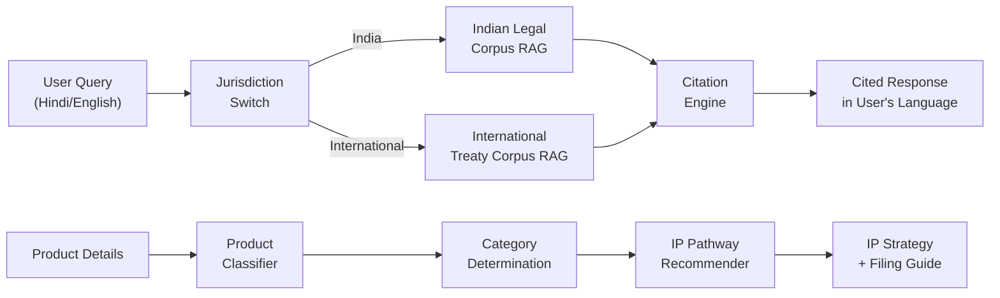
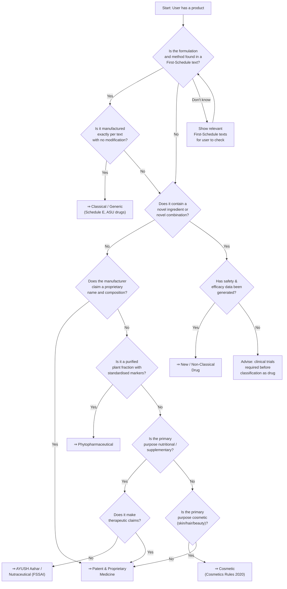
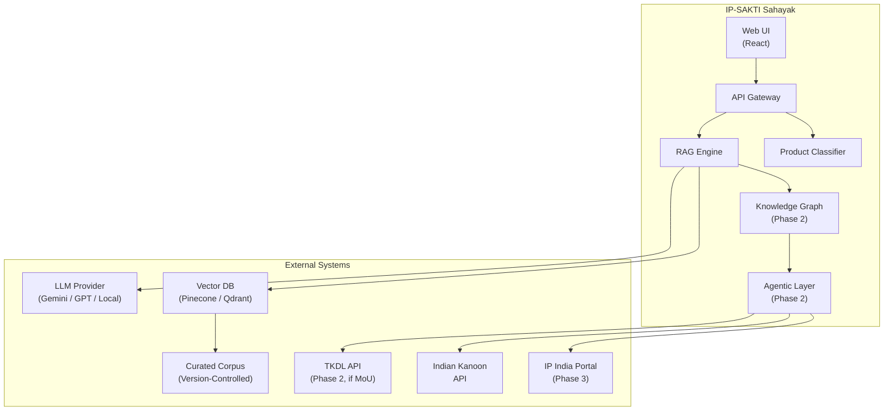

# IP-SAKTI Sahayak — Solution Specification (SRS)

> **Document ID:** IPSAKTI-SRS-001  
> **Version:** 1.0  
> **Status:** Ideation / Pre-Build  
> **Owner:** Product Engineering  
> **Last Updated:** 2026-09-27  
> **Prerequisites:** [context.md](file:///E:/Projects/Active/IP-SAKTI-1/documents/context.md), [problem.md](file:///E:/Projects/Active/IP-SAKTI-1/documents/problem.md)  
> **Standard:** Aligned with IEEE 830-1998 (SRS) adapted for AI-first products

---

## 1. Solution Vision

**IP-SAKTI Sahayak** is a deployable, multilingual AI assistant that:

1. **Classifies** an Ayurvedic product into one of six regulatory categories through a minimum-question guided workflow.
2. **Answers** IP and regulatory questions with source-cited, jurisdiction-aware responses grounded in a curated, version-tracked legal corpus.
3. **Separates** Indian and international legal layers through an explicit jurisdiction switch — never conflating the two.
4. **Scales** from a citation-grounded retrieval MVP to a knowledge-graph-backed, agentic multi-source orchestration system.



---

## 2. Functional Requirements

### 2.1 FR-01: Product Classification Engine

**Priority:** P0 (Must-Have)

| # | Requirement | Acceptance Criteria |
|---|---|---|
| FR-01.1 | System shall ask a structured sequence of clarifying questions to classify the user's product | Min 3, max 8 questions to reach classification |
| FR-01.2 | System shall classify into exactly one of: Classical/Generic, Patent & Proprietary, New/Non-Classical Drug, Phytopharmaceutical, AYUSH Aahar/Nutraceutical, Cosmetic | Classification matches expert opinion ≥85% of the time |
| FR-01.3 | System shall explain *why* the product falls into the selected category, citing the relevant rule/schedule | Each explanation references a specific rule/act section |
| FR-01.4 | System shall state the regulatory implications of the classification (licences needed, clinical evidence required, applicable standards) | All implications backed by cited source |
| FR-01.5 | System shall allow the user to override/challenge the classification and re-answer questions | Override pathway available at any point |
| FR-01.6 | System shall persist the classification result for use in subsequent IP advisory queries | Classification persists within the session |

**Classification Decision Tree:**



### 2.2 FR-02: Jurisdiction-Aware Q&A Engine

**Priority:** P0 (Must-Have)

| # | Requirement | Acceptance Criteria |
|---|---|---|
| FR-02.1 | System shall present an explicit jurisdiction selector: "India" or "International" | Visible toggle/selector on every query interface |
| FR-02.2 | When jurisdiction = India, retrieval shall be limited to Indian statutes, rules, case law, and pharmacopoeial standards | No international treaty content in Indian-jurisdiction answers |
| FR-02.3 | When jurisdiction = International, retrieval shall pull from international treaties, conventions, and comparative law | Indian domestic law excluded unless referencing India's obligations under a treaty |
| FR-02.4 | System shall never produce a response that blends Indian and international law without explicit labelling | Automated test suite validates jurisdiction separation |
| FR-02.5 | System shall support "Both" mode where Indian and international answers are presented side-by-side with clear labels | Side-by-side panel or clearly demarcated sections |
| FR-02.6 | System shall default to "India" jurisdiction unless user explicitly selects otherwise | Default state is India |

### 2.3 FR-03: Source-Cited Response Generation

**Priority:** P0 (Must-Have)

| # | Requirement | Acceptance Criteria |
|---|---|---|
| FR-03.1 | Every substantive legal/regulatory claim in a response shall include an inline citation | Format: `[Source: Patents Act 1970, Section 3(p)]` |
| FR-03.2 | Citations shall link to the specific chunk in the corpus that supports the claim | Clicking citation shows the source paragraph |
| FR-03.3 | System shall display a "Sources" panel listing all documents used to generate the response | Sources panel visible for every response |
| FR-03.4 | System shall assign a confidence score (High / Medium / Low) to each response | Score visible; Low triggers disclaimer |
| FR-03.5 | When confidence is Low or no relevant sources found, system shall respond "I don't have enough information to answer this reliably" + suggest human expert consultation | Refusal rate > 0% (system must refuse rather than hallucinate) |
| FR-03.6 | System shall never fabricate a citation (section number, case name, date) | Automated hallucination detection in CI pipeline |

### 2.4 FR-04: Multilingual Support

**Priority:** P0 (MVP: Hindi + English)

| # | Requirement | Acceptance Criteria |
|---|---|---|
| FR-04.1 | System shall accept queries in Hindi (Devanagari script) and English | Hindi query → Hindi response; English query → English response |
| FR-04.2 | System shall auto-detect query language and respond in the same language | Detection accuracy ≥ 95% for Hindi and English |
| FR-04.3 | Legal terms shall maintain consistency via a curated bilingual glossary | Glossary with ≥500 AYUSH/IP terms |
| FR-04.4 | Sanskrit/Ayurvedic terms shall be transliterated consistently using IAST or Devanagari | Configurable transliteration scheme |
| FR-04.5 | User shall be able to manually switch response language | Language toggle available |
| FR-04.6 | Citations shall show the original language of the source document | English Act cited in English even if response is in Hindi |

### 2.5 FR-05: Prior-Art / Formulation Search

**Priority:** P1 (Should-Have)

| # | Requirement | Acceptance Criteria |
|---|---|---|
| FR-05.1 | System shall accept a formulation description (ingredients, preparation method, indication) | Free-text or structured input |
| FR-05.2 | System shall search AFI, API, and ingested pharmacopoeial texts for matching or similar formulations | Returns top-5 matches with similarity score |
| FR-05.3 | System shall indicate whether the formulation is "codified TK" (found in authoritative text) or "potentially novel" | Binary classification with source |
| FR-05.4 | System shall cite the specific text, chapter, verse, and page where the match was found | Exact source reference |
| FR-05.5 | System shall highlight differences between the user's formulation and the matched prior art | Diff-style comparison view |

### 2.6 FR-06: IP Pathway Recommendation

**Priority:** P1 (Should-Have)

| # | Requirement | Acceptance Criteria |
|---|---|---|
| FR-06.1 | Based on product classification, system shall recommend applicable IP instruments | List of applicable instruments with rationale |
| FR-06.2 | System shall provide step-by-step filing guidance for each recommended instrument | Sequential steps with links to forms/portals |
| FR-06.3 | System shall estimate timelines and government fees for each IP filing | Accuracy ≥90% for fees; timeline within ±20% |
| FR-06.4 | System shall flag ABS/biodiversity compliance requirements where applicable | Auto-detection based on ingredient list |
| FR-06.5 | System shall generate a summary "IP Roadmap" document for the user | Downloadable PDF/markdown |

### 2.7 FR-07: Conversation & Session Management

**Priority:** P1 (Should-Have)

| # | Requirement | Acceptance Criteria |
|---|---|---|
| FR-07.1 | System shall maintain conversation context within a session | Follow-up questions reference prior context |
| FR-07.2 | System shall support session history with retrieval | Users can return to past sessions |
| FR-07.3 | System shall support user accounts (optional, for persistence) | OAuth/email login; guest mode available |
| FR-07.4 | System shall support feedback (thumbs up/down + text) on each response | Feedback stored for quality monitoring |

---

## 3. Non-Functional Requirements

### 3.1 Performance

| # | Requirement | Target |
|---|---|---|
| NFR-01 | Query-to-first-token latency (p50) | < 2 seconds |
| NFR-02 | Query-to-complete-response latency (p95) | < 8 seconds |
| NFR-03 | Concurrent users supported | ≥ 100 (MVP); ≥ 5,000 (production) |
| NFR-04 | Corpus ingestion time (full re-index) | < 4 hours for entire corpus |
| NFR-05 | Availability (uptime) | ≥ 99.5% |

### 3.2 Scalability

| # | Requirement | Target |
|---|---|---|
| NFR-06 | Horizontal scaling for inference | Auto-scale 1-10 inference replicas |
| NFR-07 | Corpus size supported | ≥ 10,000 documents, ≥ 50M tokens |
| NFR-08 | Language addition without re-architecture | Pluggable language modules |

### 3.3 Reliability & Accuracy

| # | Requirement | Target |
|---|---|---|
| NFR-09 | Citation accuracy (verifiable source) | ≥ 90% (MVP); ≥ 97% (production) |
| NFR-10 | Jurisdictional correctness | ≥ 95% (MVP); ≥ 99% (production) |
| NFR-11 | Product classification accuracy | ≥ 85% (MVP); ≥ 95% (production) |
| NFR-12 | Hallucination rate (fabricated citations) | < 2% (MVP); < 0.5% (production) |
| NFR-13 | "I don't know" rate (appropriate refusal) | 5-15% (healthy range) |

### 3.4 Usability

| # | Requirement | Target |
|---|---|---|
| NFR-14 | Mobile-responsive UI | Works on 360px+ screens |
| NFR-15 | Accessibility (WCAG 2.1 Level AA) | Compliant |
| NFR-16 | Time to first meaningful interaction | < 30 seconds from landing |
| NFR-17 | Zero-training usability | First-time user completes a classification without help |

### 3.5 Compliance

| # | Requirement | Target |
|---|---|---|
| NFR-18 | Data localisation (India) | User data stored on Indian servers |
| NFR-19 | DPDP Act 2023 compliance | Consent, purpose limitation, data minimisation |
| NFR-20 | No PII in LLM training data | User queries not used for model training |
| NFR-21 | GIGW 3.0 compliance (if gov.in hosted) | Pass GIGW audit |

---

## 4. Phased Delivery Roadmap

### Phase 1 — Citation-Grounded Retrieval MVP (SIH Demo)

**Timeline:** 36-hour hackathon build  
**Objective:** Demonstrate the core value proposition end-to-end.

| Feature | Scope |
|---|---|
| Product Classifier | 6-category decision tree with guided questions |
| RAG Q&A | English + Hindi; curated corpus of 20-30 key documents |
| Jurisdiction Switch | India / International toggle |
| Source Citations | Inline citations with source panel |
| Confidence Scoring | High / Medium / Low display |
| Prior-Art Check | AFI formulation search (100 formulations demo dataset) |
| UI | Responsive web app (React/Next.js) |

**Demo Script:**

```
1. User selects Hindi → Types: "मैं हल्दी से बनी एक नई दवाई बनाना चाहता हूँ। 
   क्या मैं इसका पेटेंट करा सकता हूँ?"
2. System detects Hindi → Asks classification questions in Hindi
3. User answers → System classifies as "Patent & Proprietary Medicine"
4. System provides IP options: Patent (India), Patent (PCT), Trademark, 
   Trade Secret — each with cited legal basis
5. System flags ABS requirement for turmeric sourcing
6. User switches to International jurisdiction → Gets TRIPS/PCT-specific 
   guidance with different citations
7. User asks follow-up → Contextual response with new citations
```

### Phase 2 — Knowledge Graph + Agentic Layer

**Timeline:** Months 1-6 post-hackathon  
**Objective:** Deep multi-step reasoning and proactive guidance.

| Feature | Scope |
|---|---|
| Knowledge Graph | Entities: Acts, Sections, Products, Ingredients, Cases, Institutions → Neo4j/similar |
| Agentic Orchestration | Multi-step queries decomposed into sub-queries across multiple corpus segments |
| 5+ Languages | Tamil, Telugu, Kannada, Marathi, Bengali |
| TKDL Integration | Licensed access integration (subject to CSIR MoU) |
| Case-Law Search | Indian Kanoon integration for IP case law |
| IP Roadmap Generator | PDF export with step-by-step filing guide |
| Voice Input | Whisper-based speech-to-text for Hindi/English |

### Phase 3 — Production Scale & Ecosystem

**Timeline:** Months 6-12 post-hackathon  
**Objective:** Government-grade deployment and ecosystem integration.

| Feature | Scope |
|---|---|
| E-filing Integration | Direct links/pre-fill for IPO, CGPDTM, NBA portals |
| Gazette Monitoring | Automated detection of amendments, new rules |
| Offline Mode | Progressive Web App with cached corpus subset |
| Analytics Dashboard | Usage analytics for Ministry of Ayush |
| API Access | Public API for third-party integrations |
| Expert Escalation | Human-in-the-loop routing to Ministry IP Cell |

---

## 5. Data Requirements

### 5.1 Training / Retrieval Corpus

| Corpus Segment | Document Count (Est.) | Token Count (Est.) | Format | Refresh Frequency |
|---|---|---|---|---|
| Indian IP Statutes & Rules | ~25 major Acts + rules | ~2M tokens | PDF/HTML → Markdown | On amendment |
| International Treaties | ~15 treaties + protocols | ~1M tokens | PDF → Markdown | Annual |
| Ayurvedic Pharmacopoeia (API) | 9 volumes, ~800 monographs | ~3M tokens | PDF → structured JSON | On new volume |
| Ayurvedic Formulary (AFI) | 3 parts, ~1,200 formulations | ~1.5M tokens | PDF → structured JSON | On new part |
| AYUSH Drug Rules & Guidelines | ~30 documents | ~500K tokens | PDF/HTML → Markdown | Quarterly check |
| FSSAI Regulations (AYUSH Aahar) | ~10 regulations | ~300K tokens | PDF → Markdown | On amendment |
| Case Law (curated) | ~200 landmark cases | ~2M tokens | HTML → Markdown | Monthly additions |
| TKDL (if access granted) | 4,50,000+ formulations | ~50M+ tokens | XML/DB → structured | Per CSIR updates |
| **TOTAL (without TKDL)** | **~2,300 documents** | **~10M tokens** | | |

### 5.2 Evaluation Dataset

| Dataset | Purpose | Size |
|---|---|---|
| Classification Gold Standard | Evaluate product classifier accuracy | 200 labelled product descriptions |
| Q&A Gold Standard | Evaluate RAG answer quality + citation accuracy | 500 question-answer-citation triples |
| Jurisdiction Test Set | Validate jurisdiction separation | 100 pairs (same question, different jurisdiction, different correct answer) |
| Hallucination Detection Set | Test for fabricated citations | 200 adversarial queries designed to trigger hallucination |

---

## 6. Integration Points



---

## 7. Acceptance Testing Strategy

### 7.1 User Acceptance Tests (UATs)

| # | Test Scenario | Pass Criteria |
|---|---|---|
| UAT-01 | Classify a Chyawanprash product | Correctly identified as Classical/Generic; cites AFI reference |
| UAT-02 | Classify a novel turmeric supplement | Correctly identified as AYUSH Aahar or P&P Medicine depending on claims |
| UAT-03 | Ask "Can I patent an Ayurvedic formulation?" in India jurisdiction | Response cites Section 3(p); explains TK exception |
| UAT-04 | Same question in International jurisdiction | Response cites TRIPS Art. 27; explains novelty assessment against TKDL |
| UAT-05 | Ask in Hindi: "भौगोलिक संकेत क्या है?" | Response in Hindi; cites GI Act 1999 |
| UAT-06 | Search for "Dashmoolarishta" in prior-art | Returns AFI match with volume, page, formulation number |
| UAT-07 | Ask an out-of-domain question (e.g., "What's the weather?") | System refuses gracefully: "This is outside my expertise" |
| UAT-08 | Ask a question where no source exists | System says "I don't have enough information" + suggests expert |
| UAT-09 | Rapid-fire 10 questions to test context maintenance | Follow-up questions correctly reference prior context |
| UAT-10 | Submit feedback on a response | Feedback captured and visible in admin dashboard |

### 7.2 Automated Regression Tests

| Suite | Tests | Trigger |
|---|---|---|
| Citation Accuracy | 500 Q&A pairs verified against gold standard | Every corpus update |
| Jurisdiction Separation | 100 paired queries (India vs. International) | Every model/prompt change |
| Classification Accuracy | 200 labelled products | Every classifier change |
| Hallucination Detection | 200 adversarial queries | Every model change |
| Language Detection | 200 mixed Hindi/English queries | Every NLP pipeline change |
| Performance (latency) | 50 queries under load | Every deployment |

---

## 8. Glossary (Solution-Specific)

| Term | Definition |
|---|---|
| **Agentic Orchestration** | AI pattern where an LLM decomposes a complex query into sub-tasks, routes each to the appropriate tool/source, and synthesises results |
| **Citation Engine** | Component that maps generated text spans to source corpus chunks |
| **Confidence Score** | Model's self-assessed certainty: High (>0.85), Medium (0.6-0.85), Low (<0.6) |
| **Jurisdiction Switch** | Explicit toggle ensuring retrieval is scoped to either Indian or International legal corpus |
| **Knowledge Graph** | Graph database representing entities (Acts, Sections, Products, Ingredients) and their relationships |
| **Product Classifier** | Rule-based + ML-assisted decision tree mapping an Ayurvedic product to one of six regulatory categories |
| **RAG** | Retrieval-Augmented Generation — retrieval of relevant corpus chunks followed by LLM synthesis |
| **Version-Tracked Corpus** | Legal document store where every amendment, insertion, and deletion is versioned with effective dates |

---

*This is the Software Requirements Specification. For system design and technical architecture, see [design.md](file:///E:/Projects/Active/IP-SAKTI-1/documents/design.md) and [architecture.md](file:///E:/Projects/Active/IP-SAKTI-1/documents/architecture.md).*
