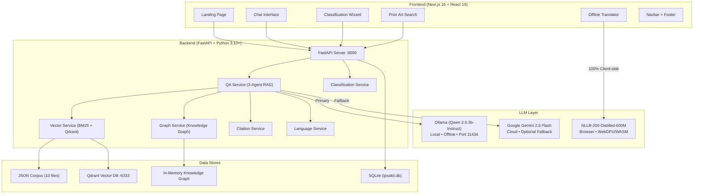
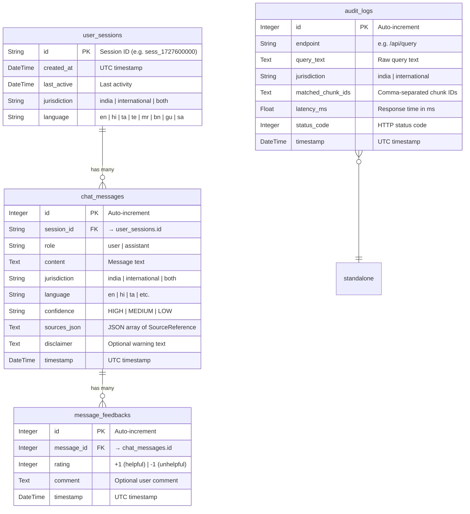
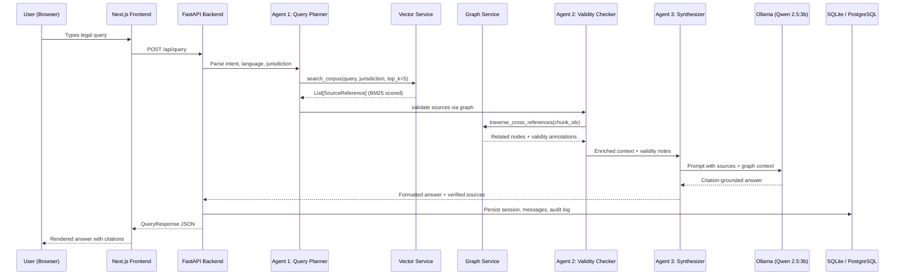

# IP-SAKTI Sahayak — Complete Tech Stack & Database Architecture

---

## 1. High-Level System Architecture



---

## 2. Tech Stack Summary

### Frontend

| Layer | Technology | Version | Purpose |
|-------|-----------|---------|---------|
| **Framework** | Next.js (App Router) | 16.3.6 | SSR, routing, API proxying |
| **UI Library** | React | 19.2.8 | Component rendering |
| **Styling** | Tailwind CSS | v4 | Utility-first CSS |
| **Icons** | Lucide React | 1.48.0 | SVG icon components |
| **Utilities** | clsx + tailwind-merge | latest | Conditional classnames |
| **Translation** | @huggingface/transformers | 4.3.0 | Offline NLLB model (WebGPU/WASM) |
| **Language** | Pure JavaScript (`.jsx`) | ES2022+ | Zero TypeScript |

### Backend

| Layer | Technology | Version | Purpose |
|-------|-----------|---------|---------|
| **Framework** | FastAPI | ≥0.100 | Async REST API |
| **Server** | Uvicorn | ≥0.22 | ASGI server with hot-reload |
| **ORM** | SQLAlchemy (Async) | ≥2.0 | Database models & sessions |
| **Validation** | Pydantic + pydantic-settings | ≥2.0 | Schema validation, .env loading |
| **Vector DB Client** | qdrant-client | ≥1.19 | Vector similarity search |
| **PDF Parser** | PyMuPDF | ≥1.24 | Corpus ingestion from PDFs |
| **HTML Parser** | BeautifulSoup4 + lxml | latest | Web scraping for corpus |
| **LLM (Primary)** | Ollama → Qwen 2.5:3b-Instruct | local | 100% offline inference |
| **LLM (Fallback)** | google-generativeai → Gemini 2.5 Flash | cloud | Optional cloud fallback |
| **Language** | Python | 3.10+ | Backend runtime |

### Infrastructure (Docker Compose)

| Service | Image | Port | Purpose |
|---------|-------|------|---------|
| **Qdrant** | `qdrant/qdrant:latest` | 6333 (HTTP), 6334 (gRPC) | Vector similarity search |
| **PostgreSQL** | `postgres:16-alpine` | 5432 | Production relational DB (optional) |
| **Redis** | `redis:7-alpine` | 6379 | Caching layer (future) |

---

## 3. Database Schema (SQLite / PostgreSQL)

> Currently using **SQLite** (`ipsakti.db`, 52 KB). Can switch to **PostgreSQL** by setting `DATABASE_URL` in `.env`.



### Table Descriptions

| Table | Rows (current) | Purpose |
|-------|----------------|---------|
| [`user_sessions`](file:///e:/Projects/Active/SIH_2026/IP-SAKTI/backend/app/models/database.py#L26-L35) | Dynamic | Tracks user chat sessions with jurisdiction & language |
| [`chat_messages`](file:///e:/Projects/Active/SIH_2026/IP-SAKTI/backend/app/models/database.py#L37-L51) | Dynamic | Stores every user query and assistant response |
| [`message_feedbacks`](file:///e:/Projects/Active/SIH_2026/IP-SAKTI/backend/app/models/database.py#L54-L63) | Dynamic | User thumbs-up/down on assistant answers |
| [`audit_logs`](file:///e:/Projects/Active/SIH_2026/IP-SAKTI/backend/app/models/database.py#L65-L75) | Dynamic | Tracks every API call with latency & matched chunks |

---

## 4. Data Stores Overview

### Store 1: SQLite / PostgreSQL (Relational)
- **File**: [`ipsakti.db`](file:///e:/Projects/Active/SIH_2026/IP-SAKTI/backend/ipsakti.db) (52 KB)
- **ORM**: SQLAlchemy 2.0 Async with `aiosqlite`
- **Tables**: 4 (sessions, messages, feedbacks, audit_logs)
- **Production**: Switchable to PostgreSQL via `DATABASE_URL`

### Store 2: JSON Corpus (Statutory Knowledge Base)
- **Path**: [`corpus/processed/`](file:///e:/Projects/Active/SIH_2026/IP-SAKTI/backend/corpus/processed)
- **Total files**: 10 JSON files
- **Total chunks**: 57 statutory provisions

| Jurisdiction | File | Chunks | Statute |
|-------------|------|--------|---------|
| 🇮🇳 India | [`patents_act_1970.json`](file:///e:/Projects/Active/SIH_2026/IP-SAKTI/backend/corpus/processed/india/patents_act_1970.json) | 13 | The Patents Act, 1970 |
| 🇮🇳 India | [`biological_diversity_act_2002.json`](file:///e:/Projects/Active/SIH_2026/IP-SAKTI/backend/corpus/processed/india/biological_diversity_act_2002.json) | 6 | Biological Diversity Act, 2002 |
| 🇮🇳 India | [`drugs_cosmetics_act_1940.json`](file:///e:/Projects/Active/SIH_2026/IP-SAKTI/backend/corpus/processed/india/drugs_cosmetics_act_1940.json) | 7 | Drugs & Cosmetics Act, 1940 |
| 🇮🇳 India | [`classical_formulations.json`](file:///e:/Projects/Active/SIH_2026/IP-SAKTI/backend/corpus/processed/india/classical_formulations.json) | ~16 | AFI/API Pharmacopoeia Formulations |
| 🇮🇳 India | [`fssai_ayush_aahar_2022.json`](file:///e:/Projects/Active/SIH_2026/IP-SAKTI/backend/corpus/processed/india/fssai_ayush_aahar_2022.json) | ~2 | FSSAI AYUSH Aahar Regulations |
| 🇮🇳 India | [`gi_act_1999.json`](file:///e:/Projects/Active/SIH_2026/IP-SAKTI/backend/corpus/processed/india/gi_act_1999.json) | ~2 | GI Act, 1999 |
| 🌐 Intl | [`nagoya_protocol.json`](file:///e:/Projects/Active/SIH_2026/IP-SAKTI/backend/corpus/processed/international/nagoya_protocol.json) | 4 | Nagoya Protocol, 2010 |
| 🌐 Intl | [`cbd_convention.json`](file:///e:/Projects/Active/SIH_2026/IP-SAKTI/backend/corpus/processed/international/cbd_convention.json) | ~3 | CBD Convention |
| 🌐 Intl | [`trips_agreement.json`](file:///e:/Projects/Active/SIH_2026/IP-SAKTI/backend/corpus/processed/international/trips_agreement.json) | ~3 | TRIPS Agreement |
| 🌐 Intl | [`pct_treaty.json`](file:///e:/Projects/Active/SIH_2026/IP-SAKTI/backend/corpus/processed/international/pct_treaty.json) | ~1 | PCT Treaty |

**Chunk Schema** (per JSON object):
```json
{
  "chunk_id": "in-patent-sec3-p",
  "title": "Section 3(p) - Traditional Knowledge",
  "section_or_article": "Section 3(p)",
  "statute": "The Patents Act, 1970",
  "jurisdiction": "india",
  "doc_type": "statute",
  "effective_date": "2003-05-20",
  "url": "https://www.indiacode.nic.in/...",
  "text": "Full statutory text...",
  "tags": ["section 3(p)", "traditional knowledge", "tkdl"]
}
```

### Store 3: In-Memory Knowledge Graph
- **Service**: [`graph_service.py`](file:///e:/Projects/Active/SIH_2026/IP-SAKTI/backend/app/services/graph_service.py)
- **Nodes**: 57 (one per corpus chunk)
- **Edges**: 29 (statutory cross-references)
- **Edge types**: `AMENDS`, `REPEALED_BY`, `CROSS_REFERENCES`, `IMPLEMENTS`
- **Loaded at**: Server startup (auto-built from corpus JSON)

### Store 4: Qdrant Vector Database
- **Port**: 6333 (HTTP) / 6334 (gRPC)
- **Purpose**: Semantic similarity search over embedded corpus
- **Status**: Optional — falls back to BM25 keyword search if unavailable

---

## 5. Backend Service Architecture

```
backend/app/
├── main.py                     # FastAPI app, CORS, router registration
├── core/
│   └── config.py               # Pydantic settings (env, LLM, DB URLs)
├── models/
│   ├── database.py             # SQLAlchemy models (4 tables) + async session
│   └── schemas.py              # Pydantic request/response schemas (10 models)
├── api/routers/
│   ├── health.py               # GET /api/health
│   ├── query.py                # POST /api/query + POST /api/query/feedback
│   ├── classify.py             # GET /api/classify/start + POST /api/classify/answer
│   ├── prior_art.py            # POST /api/search/prior-art
│   └── pathway.py              # GET /api/pathway/recommend/{category}
└── services/
    ├── qa_service.py           # 3-Agent RAG Pipeline (Planner→Validator→Synthesizer)
    ├── graph_service.py        # In-memory knowledge graph (57 nodes, 29 edges)
    ├── vector_service.py       # BM25 + Qdrant hybrid retrieval
    ├── citation_service.py     # Citation verification & formatting
    ├── classification_service.py # 6-tier AYUSH product classification wizard
    └── language_service.py     # Hindi/English detection + IP glossary
```

### API Endpoints

| Method | Endpoint | Service | Description |
|--------|----------|---------|-------------|
| `GET` | `/api/health` | Health | Server status check |
| `POST` | `/api/query` | QA (RAG) | Main legal Q&A with source citations |
| `POST` | `/api/query/feedback` | Feedback | Submit rating on an answer |
| `GET` | `/api/classify/start` | Classification | Start 6-tier product classification |
| `POST` | `/api/classify/answer` | Classification | Submit wizard step answer |
| `POST` | `/api/search/prior-art` | Vector | Search AFI/API formulation database |
| `GET` | `/api/pathway/recommend/{cat}` | Pathway | IP filing roadmap & fees |

### Pydantic Schemas ([`schemas.py`](file:///e:/Projects/Active/SIH_2026/IP-SAKTI/backend/app/models/schemas.py))

| Schema | Purpose |
|--------|---------|
| `QueryRequest` | User query with jurisdiction, language, session_id |
| `QueryResponse` | Answer + confidence + sources + disclaimer |
| `SourceReference` | Single corpus citation (doc_title, section_id, excerpt, score) |
| `ClassificationQuestion` | Wizard step with bilingual title + options |
| `ClassificationQuestionOption` | Single option with next_question_id or target_category |
| `ClassificationAnswerRequest` | User's selected option submission |
| `ClassificationResult` | Final 6-tier category with cited_rules & next_steps |
| `PriorArtSearchRequest` | Ingredients list + free text for formulation search |
| `PriorArtMatch` | Matched AFI formulation with score & patentability |
| `PriorArtSearchResponse` | Matches + summary_verdict + recommendation |
| `FeedbackRequest` | Rating + comment on a response |

---

## 6. Frontend Component Tree

```
frontend/src/
├── app/
│   ├── layout.jsx              # Root layout (fonts, metadata)
│   ├── globals.css             # Design system (Tailwind config)
│   ├── page.jsx                # Landing page (hero, features)
│   ├── chat/page.jsx           # Legal Q&A chat interface
│   ├── classify/page.jsx       # Product classification wizard
│   ├── search/page.jsx         # Prior art search
│   └── translate/page.jsx      # Offline translation (NLLB)
├── components/
│   ├── Navbar.jsx              # Navigation header
│   ├── Footer.jsx              # Page footer
│   ├── ChatInterface.jsx       # Chat UI (messages, input, sources)
│   ├── ClassificationWizard.jsx # Step-by-step classification flow
│   ├── PriorArtSearch.jsx      # Ingredient-based formulation search
│   ├── OfflineTranslator.jsx   # WebGPU/WASM translation widget
│   ├── LanguageSelector.jsx    # 8-language dropdown
│   ├── JurisdictionSwitch.jsx  # India / International toggle
│   ├── SourcesPanel.jsx        # Citation display panel
│   ├── AyurvedicIcons.jsx      # Custom SVG icon components
│   └── AyurvedicMandala.jsx    # Decorative mandala SVG
├── context/                    # React context providers
├── hooks/                      # Custom React hooks
├── lib/
│   └── api.js                  # Backend API client (fetch wrappers)
└── workers/                    # Web Workers (translation model)
```

---

## 7. Configuration ([`.env`](file:///e:/Projects/Active/SIH_2026/IP-SAKTI/backend/.env))

| Variable | Default | Description |
|----------|---------|-------------|
| `LLM_PROVIDER` | `ollama` | Primary LLM: `ollama` or `gemini` |
| `OLLAMA_BASE_URL` | `http://localhost:11434` | Local Ollama server URL |
| `OLLAMA_MODEL` | `qwen2.5:3b-instruct` | Local model name |
| `GEMINI_API_KEY` | _(empty)_ | Optional Gemini API key |
| `DATABASE_URL` | `sqlite+aiosqlite:///./ipsakti.db` | SQLite or PostgreSQL |
| `QDRANT_URL` | `http://localhost:6333` | Qdrant vector DB |
| `HOST` / `PORT` | `0.0.0.0` / `8000` | Server bind address |

---

## 8. Data Flow — Query Pipeline


