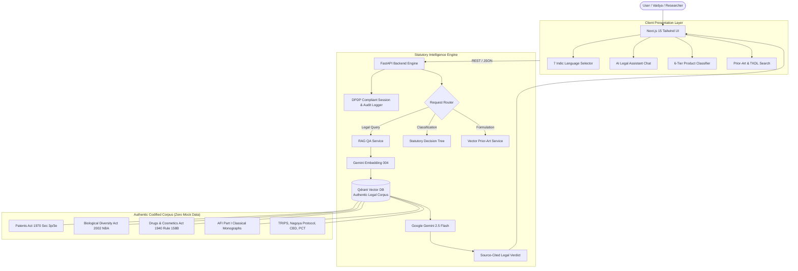

# AYURA — IP-SAKTI Sahayak 🌿⚖️
### AI-Powered Classical Knowledge & Precision Legal Intelligence Engine for the Ministry of Ayush

[](LICENSE)
[](https://www.python.org/)
[](https://fastapi.tiangolo.com/)
[](https://nextjs.org/)
[](https://qdrant.tech/)
[](https://deepmind.google/technologies/gemini/)
[](SECURITY.md)

---

## 📖 Overview

**AYURA (IP-SAKTI Sahayak)** is an open-source, evidence-grounded regulatory and intellectual property (IP) intelligence platform designed for the **Ayurvedic medicine and AYUSH innovation ecosystem**.

India possesses over 5,000 years of documented classical traditional medicine (Charaka Samhita, Sushruta Samhita, Ashtanga Hridaya). However, AYUSH innovators frequently encounter critical obstacles:
1. **Biopiracy & Predatory Patents**: Classical formulations being patented abroad in violation of prior-art principles.
2. **Section 3(p) TK-Bar Confusion**: Uncertainty around what constitutes an inventive step versus codified traditional knowledge under the Indian Patents Act, 1970.
3. **Complex Regulatory Pathways**: Fragmented licensing requirements spanning the Drugs & Cosmetics Act 1940 (Rule 158-B, Schedule T), FSSAI AYUSH Aahar regulations, and National Biodiversity Authority (NBA) Access and Benefit Sharing (ABS) mandates.
4. **AI Hallucinations in Legal Tech**: Generic AI chatbots generating fabricated section numbers and misleading legal guidance.

**AYURA solves this by strictly enforcing retrieval-augmented generation (RAG) anchored entirely in authentic statutory gazettes and pharmacopoeial monographs — with zero mock data and mandatory inline citations.**

---

## 🏛️ System Architecture



---

## 🚀 Key Modules

### 1. AI Legal Assistant (Jurisdiction-Aware RAG)
- **Strict Jurisdiction Isolation**: Query Indian law to receive only Indian statutes (Patents Act, BD Act, D&C Act). Query international to receive TRIPS, PCT, and Nagoya Protocol provisions.
- **Mandatory Inline Citations**: Every single legal statement requires an inline bracketed citation (e.g., `[Source: Patents Act 1970, Section 3(p)]`). If verified sources are insufficient, the AI issues a strict safety refusal rather than hallucinating.
- **Audit Logging**: Fully compliant with the DPDP Act 2023 with tamper-resistant query audit logs.

### 2. 6-Category Regulatory Product Classifier
Guided decision tree that determines the exact statutory pathway for Ayurvedic products under Indian law:
1. **Classical ASU Drug** (Drugs & Cosmetics Act 1940, Section 3(a))
2. **Patent & Proprietary (P&P) Medicine** (D&C Act 1940, Section 3(h))
3. **Phytopharmaceutical Drug** (D&C Rules Chapter IV-A)
4. **Nutraceutical / Food Supplement** (FSSAI Regulations 2022)
5. **Cosmeceutical / Ayurvedic Cosmetics** (D&C Rules Part XIII)
6. **AYUSH Aahar** (FSSAI AYUSH Aahar Safety & Standards Regulations 2022)

### 3. Prior-Art & TKDL Formulation Search
- Input formulation ingredients and indications to compute high-dimensional vector similarity against **Ayurvedic Formulary of India (AFI Part I)** monographs.
- Identifies classical prior-art barriers, indication overlaps, and patentability statuses before expensive patent applications are filed.

---

## 🌐 7 Supported Languages

AYURA natively supports 7 official Indian languages across the entire user interface and AI responses:

| Code | Script | Language | Cultural / Statutory Scope |
|:---:|:---:|:---:|:---|
| `en` | Latin | **English** | International & IPO Patent Filings |
| `hi` | देवनागरी | **हिन्दी** | Ministry of Ayush & National Regulatory Guidance |
| `sa` | देवनागरी | **संस्कृतम्** | Classical Samhita & Pharmacopoeial Texts (चरक, सुश्रुत, AFI) |
| `ta` | தமிழ் | **Tamil** | Siddha Classical System & Southern Formulations |
| `te` | తెలుగు | **Telugu** | Regional AYUSH Practitioners & Researchers |
| `mr` | देवनागरी | **मराठी** | State Licensing & AYUSH MSME Support |
| `bn` | বাংলা | **Bengali** | Eastern Botanical Heritage & Formulations |

---

## 🛠️ Tech Stack

| Layer | Technologies |
|---|---|
| **Frontend** | Next.js 15 (App Router), React 19, TypeScript, Vanilla Tailwind CSS v4, Lucide Icons |
| **Backend** | Python 3.11, FastAPI, Pydantic v2, SQLAlchemy (Async SQLite) |
| **Vector DB** | Qdrant Vector Engine (Cosine Distance, 768-dim embeddings) |
| **AI / LLM** | Google Gemini 2.5 Flash / Gemini 2.0 Flash, Gemini Text-Embedding-004 |
| **Containerization** | Docker, Docker Compose |

---

## ⚡ Quickstart Guide

### Prerequisites
- [Git](https://git-scm.com/)
- [Python 3.10+](https://www.python.org/)
- [Node.js 18+](https://nodejs.org/)
- [Docker Desktop](https://www.docker.com/) (for Qdrant vector database)
- [Gemini API Key](https://aistudio.google.com/)

---

### Step 1: Clone the Repository
```bash
git clone https://github.com/SHREESABARI-5143/IP-SAKTI.git
cd IP-SAKTI
```

---

### Step 2: Start Qdrant Vector Database
```bash
docker run -d -p 6333:6333 -p 6334:6334 --name qdrant qdrant/qdrant
```
*(Or use `docker-compose up -d qdrant`)*

---

### Step 3: Setup & Run Backend
```bash
cd backend

# Create and activate virtual environment
python -m venv venv
# On Windows:
.\venv\Scripts\Activate.ps1
# On Linux/macOS:
source venv/bin/activate

# Install dependencies
pip install -r requirements.txt

# Configure environment variables
cp .env.example .env
# Edit .env and paste your GEMINI_API_KEY

# Ingest and index the authentic statutory corpus into Qdrant
python scripts/embed_and_index_qdrant.py

# Launch FastAPI server
python -m uvicorn app.main:app --host 0.0.0.0 --port 8000 --reload
```
Backend API will be live at `http://localhost:8000` (Swagger docs at `http://localhost:8000/docs`).

---

### Step 4: Setup & Run Frontend
```bash
cd ../frontend

# Install dependencies
npm install

# Start Next.js development server
npm run dev
```
Open [http://localhost:3000](http://localhost:3000) in your browser.

---

## 📂 Project Structure

```
AYURA/
├── .github/
│   ├── ISSUE_TEMPLATE/
│   │   ├── bug_report.md
│   │   └── feature_request.md
│   ├── PULL_REQUEST_TEMPLATE.md
│   └── workflows/
│       └── ci.yml
├── backend/
│   ├── app/
│   │   ├── api/routers/      # FastAPI endpoints (query, classify, prior_art, pathway)
│   │   ├── core/             # Configuration & environment settings
│   │   ├── models/           # SQLAlchemy DB & Pydantic schemas
│   │   └── services/         # QA Service, Vector Service, Classification Engine
│   ├── scripts/              # Corpus ingestion & Qdrant indexing scripts
│   ├── .env.example
│   └── requirements.txt
├── frontend/
│   ├── public/
│   │   └── ayurveda_hero_bg.jpg  # Mild Ayurvedic botanical background
│   ├── src/
│   │   ├── app/              # Next.js App Router (/chat, /classify, /search)
│   │   ├── components/       # UI components & authentic Ayurvedic SVG icons
│   │   └── lib/              # API clients & type definitions
│   ├── .env.example
│   └── package.json
├── data/                     # Authentic statutory text corpora (Patents Act, BD Act, AFI)
├── architecture.md           # Full system architecture documentation
├── problem.md                # Problem statement & sector challenges
├── solution.md               # Solution design & innovation pillars
├── security.md               # Security & DPDP Act compliance architecture
├── .gitignore                # Root gitignore protecting secrets and caches
├── CONTRIBUTING.md           # Community contribution guidelines
├── CODE_OF_CONDUCT.md        # Contributor Covenant Code of Conduct
├── SECURITY.md               # Security policy & vulnerability reporting
├── LICENSE                   # Apache 2.0 Open Source License
└── README.md                 # Primary project documentation
```

---

## 🤝 Contributing

We welcome contributions from Ayurvedic practitioners, legal researchers, developers, and patent professionals. Please read our [Contributing Guidelines](CONTRIBUTING.md) and [Code of Conduct](CODE_OF_CONDUCT.md) before submitting pull requests.

---

## 📜 License

This project is licensed under the **Apache License 2.0** — see the [LICENSE](LICENSE) file for details.

---

<p align="center">
  <b>Built with devotion to India's Traditional Ayurvedic Knowledge & Legal Sovereignty 🇮🇳</b>
</p>
