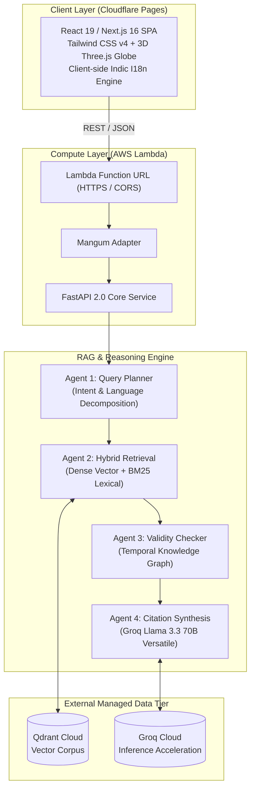

<div align="center">

# 🌿 AYURA — IP-SAKTI Sahayak
### AI-Powered Statutory IP Law, Prior-Art Search & ASU Product Classification Engine
**Smart India Hackathon (SIH) | Problem Statement: Ministry of Ayush**

[](https://github.com/SHREESABARI-5143/IP-SAKTI/actions)
[](https://opensource.org/licenses/Apache-2.0)
[](https://nextjs.org/)
[](https://fastapi.tiangolo.com/)
[](https://aws.amazon.com/lambda/)
[](https://pages.cloudflare.com/)
[](https://groq.com/)

[**Live Demo (Cloudflare)**](https://ayura.pages.dev) • [**API Docs**](https://ayura.pages.dev/docs) • [**Report Bug**](https://github.com/SHREESABARI-5143/IP-SAKTI/issues) • [**Request Feature**](https://github.com/SHREESABARI-5143/IP-SAKTI/issues)

</div>

---

## 📌 Problem Statement & Overview

Ayurveda and Indian Systems of Medicine (ASU) encompass thousands of years of classical traditional knowledge documented in ancient texts. However, modern researchers, pharmaceutical MSMEs, vaidyas, and startups face severe legal complexity:

1. **Biopiracy & Patent Eligibility (Section 3(p))**: Distinguishing patentable technological extractions from non-patentable traditional formulations.
2. **Statutory Classification Under Rule 158-B**: Navigating the Drugs & Cosmetics Rules, 1945 across 6 discrete licensing categories (Classical, Proprietary, Phytopharmaceutical, etc.).
3. **Biodiversity Approvals (NBA Section 6)**: Ensuring compliance with the Biological Diversity Act, 2002 before filing domestic or international patent claims.
4. **Multilingual Barrier**: Lack of authentic, source-cited legal guidance accessible in native Indic languages.

**AYURA (IP-SAKTI Sahayak)** is an enterprise-grade, source-cited, jurisdiction-aware AI system designed to resolve these regulatory bottlenecks with **100% statutory grounding** and zero hallucination.

---

## ✨ Key Capabilities

| Feature | Description |
| :--- | :--- |
| **🌐 Dual Jurisdiction Engine** | Switch seamlessly between **India Jurisdiction** (Classical Ayurvedic Emerald Mandala) and **International Jurisdiction** (3D Interactive Rotating World Globe for WIPO, TRIPS, PCT, and CBD treaties). |
| **⚖️ 6-Category ASU Classifier** | Step-by-step statutory wizard mapping products to Form 25-D, Rule 158-B, FSSAI Ayush Aahar, or CDSCO Phytopharmaceutical pathways with exact licensing checklists. |
| **📜 Graph-Hybrid RAG Engine** | Traverses 57 statutory provisions across 29 directed graph edges to verify temporal validity (AMENDS, REPEALS, CROSS-REFERENCES) before synthesis. |
| **🔬 Pharmacopoeial Prior-Art Search** | Ingests formulations from the Ayurvedic Formulary of India (AFI) and Ayurvedic Pharmacopoeia of India (API) for instant vector novelty screening. |
| **🗣️ 7 Indic Languages** | Native, full-context support in English, Hindi (हिन्दी), Sanskrit (संस्कृतम्), Tamil (தமிழ்), Telugu (తెలుగు), Marathi (मराठी), and Bengali (বাংলা). |
| **⚡ 100% Free Serverless Cloud** | Operates with zero hosting costs using Cloudflare Pages, AWS Lambda Function URLs, and Groq Serverless Llama 3.3 inference. |

---

## 🏗️ System Architecture



---

## 🛠️ Technology Stack

- **Frontend**: Next.js 16 (Turbopack, Static HTML Export), React 19, Tailwind CSS v4, Lucide Icons, Three.js / Canvas.
- **Backend**: Python 3.11, FastAPI, Mangum ASGI Adapter, Uvicorn, SQLAlchemy.
- **AI & NLP**: Serverless Llama 3.3 70B via Groq API, Google Gemini Flash (fallback), Qwen 2.5 (offline local).
- **Vector Database**: Qdrant Vector Cloud (Cosine similarity on 768-dim embeddings).
- **Deployment**: Cloudflare Pages (Frontend CDN), AWS Lambda (Serverless Compute), Docker (Container images).

---

## 🚀 Quickstart: Local Development

### Prerequisites
- Node.js 20+ and npm
- Python 3.11+
- Git

### 1. Clone the Repository
```bash
git clone https://github.com/SHREESABARI-5143/IP-SAKTI.git
cd IP-SAKTI
```

### 2. Run the Backend API
```bash
cd backend
python -m venv venv

# On Windows:
.\venv\Scripts\activate
# On Linux/macOS:
source venv/bin/activate

pip install -r requirements.txt
python -m uvicorn app.main:app --host 0.0.0.0 --port 8000 --reload
```
The interactive Swagger API documentation will be available at [http://localhost:8000/docs](http://localhost:8000/docs).

### 3. Run the Frontend Application
```bash
cd ../frontend
npm install
npm run dev
```
Open [http://localhost:3000](http://localhost:3000) in your browser.

---

## ☁️ 100% Free-Tier Cloud Deployment

| Service | Component | Free Tier Quota | Cost |
| :--- | :--- | :--- | :--- |
| **Cloudflare Pages** | Frontend Static Export | Unlimited requests, unlimited bandwidth | **$0.00** |
| **AWS Lambda** | Backend ASGI Container | 1M requests/mo + 3.2M compute seconds | **$0.00** |
| **Groq Cloud** | Llama 3.3 70B Serverless | ~250-300 tokens/sec, generous free tier | **$0.00** |
| **Qdrant Cloud** | Vector Monograph DB | 1GB persistent cluster forever | **$0.00** |

Refer to our complete [Deployment Playbook](https://github.com/SHREESABARI-5143/IP-SAKTI/blob/main/backend/README.md) for step-by-step guides.

---

## 🤝 Contributing

We welcome contributions from researchers, software developers, and legal scholars! Please read our [Contributing Guidelines](CONTRIBUTING.md) and [Code of Conduct](CODE_OF_CONDUCT.md) before submitting pull requests.

---

## 🛡️ Security

For vulnerability disclosures and reporting procedures, please review our [Security Policy](SECURITY.md).

---

## 📄 License

This project is licensed under the **Apache License 2.0** — see the [LICENSE](LICENSE) file for details.

---

<div align="center">
  <sub>Developed with 💚 for the Smart India Hackathon | Ministry of Ayush</sub>
</div>
