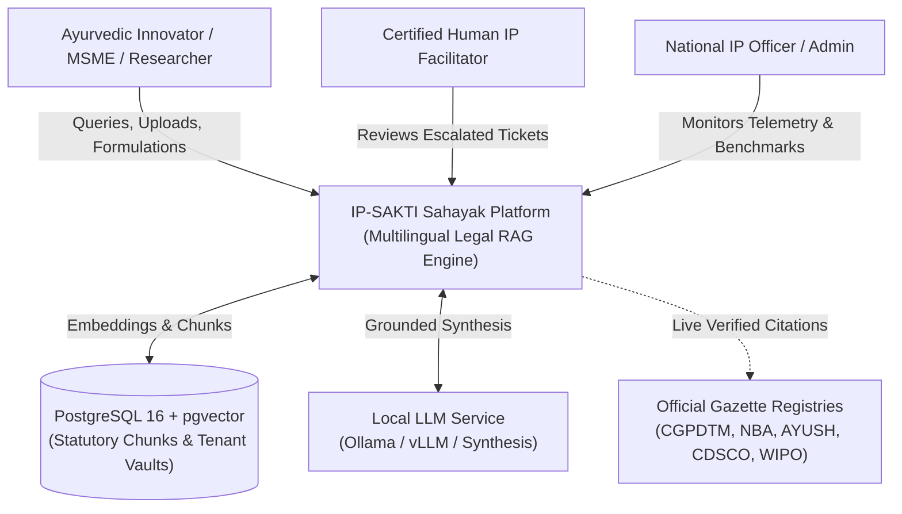
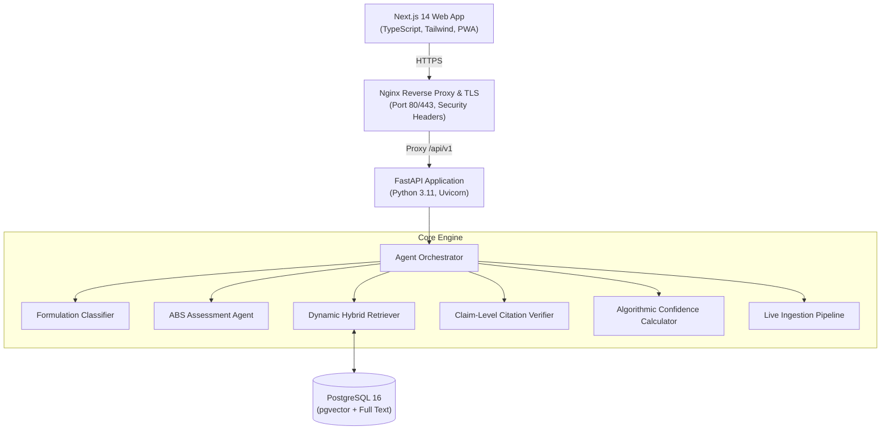

# IP-SAKTI Sahayak — Architecture & C4 System Model

## 1. System Context Diagram (C4 Level 1)

## 2. Container Diagram (C4 Level 2)

## 3. End-to-End Grounded Chat Execution Flow

1. **Input Sanitization**: Query is scrubbed of prompt-injection attempts and classified for intent (Greeting vs Legal Inquiry vs Out-of-Scope).
2. **Concept Normalization**: Multi-script Indic concepts (Hindi / Tamil / Tanglish) are normalized to canonical statutory terminology.
3. **Dynamic Retrieval**: Hybrid BM25 and vector similarity search queries live database chunks filtered strictly by Jurisdiction and Namespace.
4. **Answer Synthesis**: Pluggable LLM generates a structured legal assessment citing primary provisions `[1]`, `[2]`.
5. **Claim-Level Grounding**: `CitationVerifier` validates token overlap between claims and retrieved statutory evidence, removing ungrounded claims.
6. **Algorithmic Confidence**: Computes composite confidence based on authority hierarchy, retrieval relevance, and citation grounding. Low confidence triggers automatic safe abstention or human facilitator escalation.
